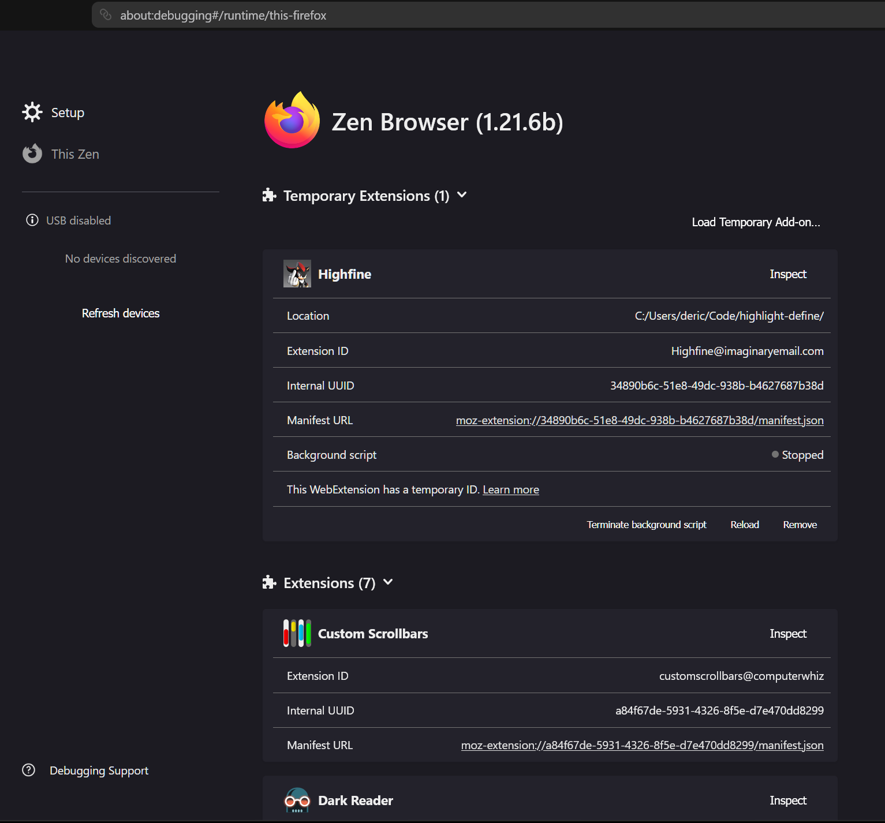
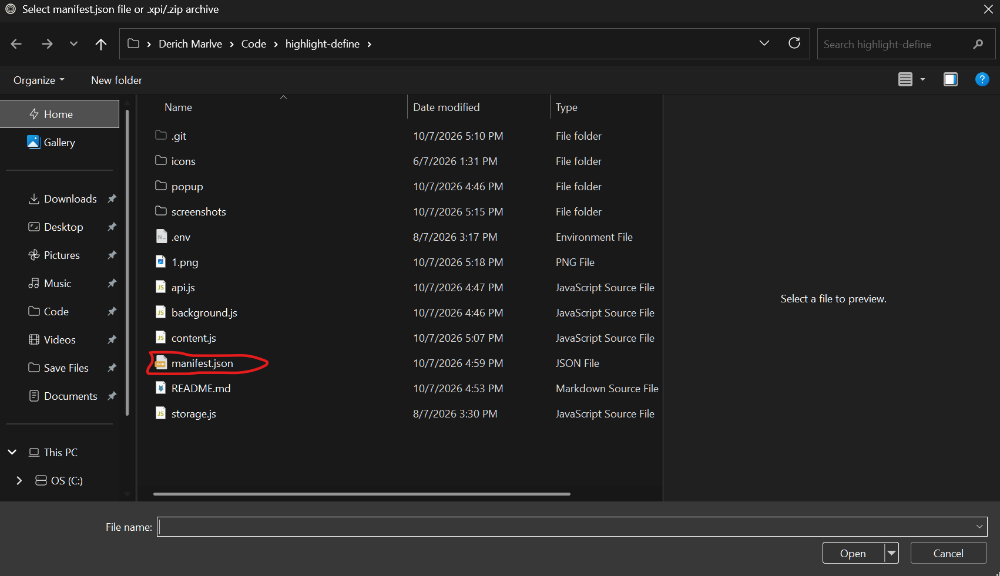
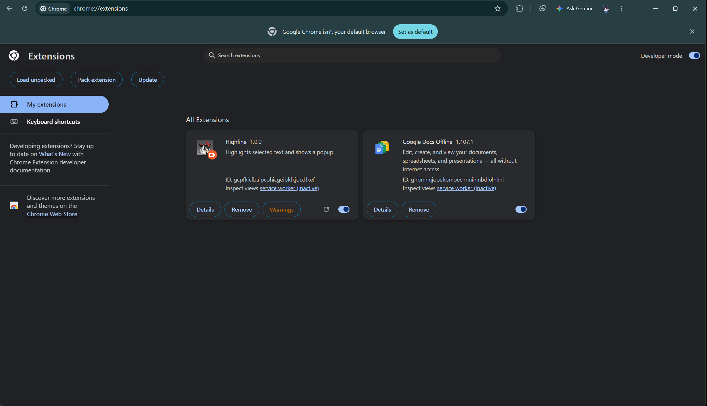
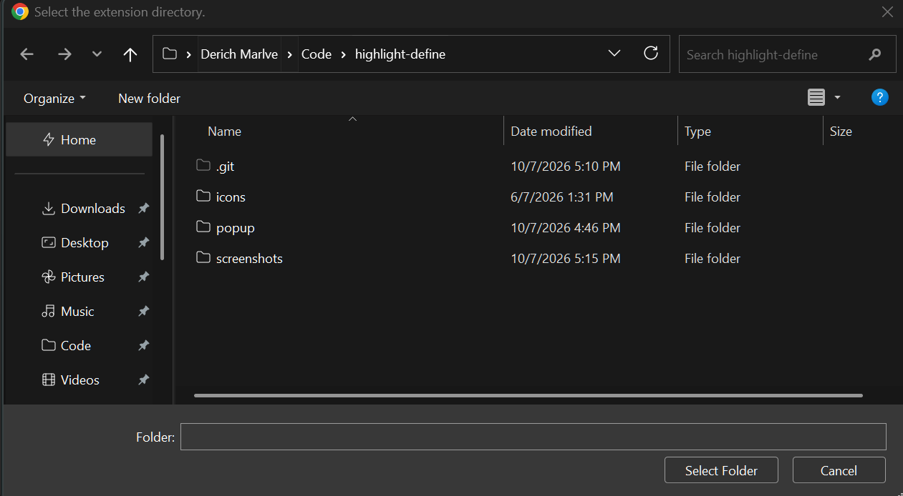

https://github.com/user-attachments/assets/d1b0bde5-08eb-48b6-af78-8faec9c6629c


# Highfine

A browser extension that translates Korean text on any webpage. Highlight a word or phrase, click the trigger button that appears, and get a structured breakdown — definitions, part of speech, and bilingual example sentences — without leaving the page.

## Features

- **Inline translation** — select Korean text on any page, a small trigger button appears next to your cursor
- **Translation Limit** — Up to 580 translation per day / 40 translation per minute, cycling through Gemini Models.
- **Safe API Key Storage** — API Key is stored in client's storage local.
- **Structured results** — headword, up to 3 numbered meanings, each with a definition and a Korean/English example sentence pair
- **Skeleton loading state** — a shimmer placeholder shows immediately while the request is in flight, with a seamless crossfade into the real result once it resolves
- **BYOK (Bring Your Own Key)** — you provide your own Gemini API key via the extension popup; it's stored locally on your device and never bundled into the extension code
- **Caching** — repeat lookups of the same word are served from cache rather than re-hitting the API

## Architecture: Shadow DOM isolation

The trigger button and result card are mounted inside a **shadow root**, not appended directly to the page's `document.body`. This was added after discovering that dark-mode/reader tools (e.g. Zen Internet) rewrite element styles by walking the page's DOM — since our injected elements looked like ordinary page content, they'd get recolored into invisibility.

How it works:

- `content.js` creates one `<div id="highfine-host">`, appended to `document.documentElement`
- `shadowHost.attachShadow({ mode: "open" })` creates a walled-off DOM subtree
- All UI (button, ring, skeleton, result card) is built and appended *inside* that shadow root, not `document.body`
- All CSS lives in a `<style>` tag injected directly into the shadow root (not a linked stylesheet) — this keeps it fully self-contained and invisible to page-level style scanning

Practical consequences of this:

- Every DOM lookup in `content.js` uses `shadowRoot.querySelector(...)` instead of `document.getElementById(...)`, since light-DOM lookups can't see into a shadow root
- Click/mouseup events still bubble out to `document` (shadow DOM doesn't block event propagation for `composed: true` events like `click`/`mouseup`), but `event.target` gets **retargeted** to the shadow host when observed from outside — use `event.composedPath()` to get the real element that was interacted with, not `event.target.closest(...)`

## Setup

Zen Browser / Firefox
Clone or download this repository.
Open about:debugging.
Select This Firefox → Load Temporary Add-on.
Select the extension's manifest.json file.

<p>   </p>

Google Chrome
Clone or download this repository.
Open chrome://extensions/.
Enable Developer mode.
Click Load unpacked and select the extension folder.

<p>   </p>

1. Clone/download this repo
2. Load the extension as a temporary/unpacked add-on (Firefox/Zen Browser: `about:debugging` → "This Firefox" → "Load Temporary Add-on")
3. Click the Highfine icon in your toolbar and enter your Gemini API key
   - Get a free key from [Google AI Studio](https://aistudio.google.com/)
4. Highlight any Korean text on a webpage and click the translate button that appears

## Tech stack

- **Manifest V3**, targeting Firefox / Zen Browser
- Vanilla JS — no TypeScript toolchain, no bundler (content scripts can't use native ES `import`, so dependencies are kept minimal)
- **Gemini Interactions API** (`/v1beta/interactions`) via raw `fetch()`, with structured output (`responseSchema` + `responseMimeType: "application/json"`) for consistent meaning/definition/example fields
- Model fallback/rotation system to gracefully handle 429/503 errors

## Project structure

```
├── manifest.json
├── content.js          # injected into pages — selection detection, trigger button, result card
├── content.css          # styling for the trigger button and result popup
├── background.js        # background service worker, message handling
├── api.js                # Gemini API calls, model fallback logic
├── storage.js            # API key + cache read/write (browser.storage.local)
└── popup/
    ├── popup.html         # extension toolbar popup (API key entry)
    ├── popup.css
    └── popup.js
```

## Development notes

- Background script logs only appear in `about:debugging`'s extension inspector, **not** the page's F12 DevTools
- Dev tooling uses `web-ext`; on Windows, WSL + local `npx` install is more reliable than a global install if you hit PATH issues
- **`composedPath()` must be captured synchronously, before any `await`.** It only reflects reality while the event is actively dispatching — once an `async` handler yields at an `await`, the browser resets the event's internal state and `composedPath()` returns an empty array on any later call. Bit us once: the mouseup handler awaited an API-key check *before* checking `composedPath()`, so the "ignore clicks on the translate button" guard silently failed, and clicking the button would create it and then immediately have it deleted by the same handler resuming a moment later.

## Disclaimer

Highfine uses a **Bring Your Own Key (BYOK)** model — you provide your own Gemini
API key, which is used to make translation requests on your behalf.

**Where your key is stored:** Your API key is saved using `browser.storage.local`,
a storage area local to your browser profile on your own device. It is never
transmitted to Highfine's developer, embedded in the extension's code, or sent
to any server other than Google's Gemini API directly. No analytics or logging
of your key take place.

**What this doesn't mean:** Local storage is not encrypted. It offers the same
level of protection as any other local application data on your device — it
will not leak to Highfine's developer or any third party through normal use of
the extension, but it is not a hardened secrets vault. If your device itself is
compromised (malware, shared/unsecured machine, etc.), any locally stored data,
including this key, could be at risk. Treat your API key with the same care you
would any other credential.

**Responsibility:** You are solely responsible for your own Gemini API key,
including any usage, billing, or rate-limit charges incurred through Google's
API while using this extension. The developer of Highfine is not liable for
any costs, data loss, or damages resulting from the use, misuse, exposure, or
revocation of your API key. Use of this extension is at your own risk.
